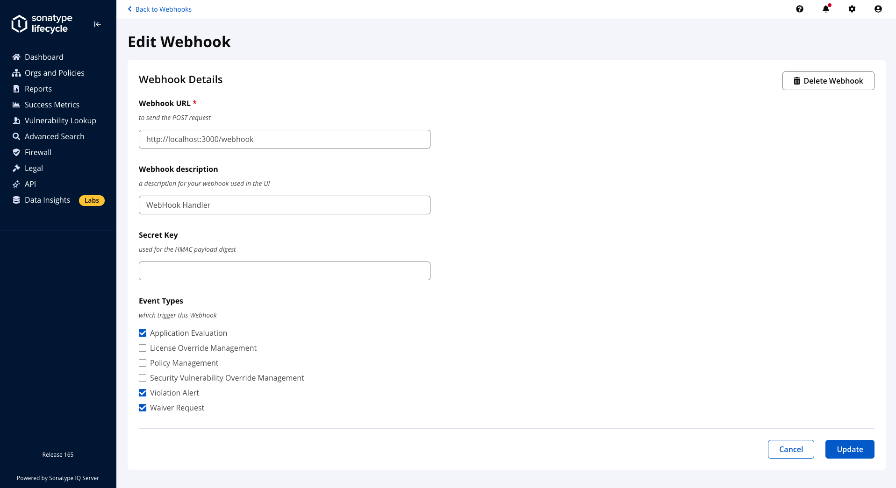
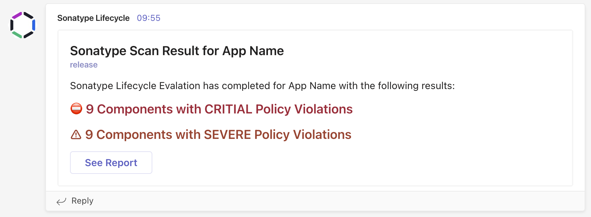

# Sonatype Lifecycle Webhook Handler

[](https://github.com/sonatype-nexus-community/sonatype-webhook-handler/)
[](https://github.com/sonatype-nexus-community/sonatype-webhook-handler/blob/main/LICENSE)
[](https://github.com/sonatype-nexus-community/sonatype-webhook-handler/issues)
[](https://github.com/sonatype-nexus-community/sonatype-webhook-handler/network)
[](https://github.com/sonatype-nexus-community/sonatype-webhook-handler/stargazers)

This project contains an example (working) Web Hook handler for [Sonatype Lifecycle](https://www.sonatype.com/products/open-source-security-dependency-management){:target="_blank"} that can publish messages to Microsoft Teams Channel(s), Slack Channel(s), or open Jira Issues.

**Contents**

- [Configuration](#configuration)
  - [Configure the Webhook Handler](#configure-the-webhook-handler)
  - [Configure Jira](#configure-jira)
  - [Configure Microsoft Teams](#configure-microsoft-teams)
  - [Configure Slack](#configure-slack)
  - [Configure Sonatype Lifecycle](#configure-sonatype-lifecycle)
- [Running the Webook Handler](#running-the-webook-handler)
  - [As a Container](#as-a-container)
  - [Manually (from source) - not recommended](#manually-from-source---not-recommended)
- [Testing](#testing)
- [The Fine Print](#the-fine-print)


## Configuration

### Configure Jira

Configuring the Jira API to create issues is dependent on the version of Jira you have in use (Cloud, Data-Center, etc.). This blog will be helpful for more detailed setup steps: [https://blog.developer.atlassian.com/creating-a-jira-cloud-issue-in-a-single-rest-call/](https://blog.developer.atlassian.com/creating-a-jira-cloud-issue-in-a-single-rest-call/){:target="_blank"}

1. Create a user API token
2. Make a string of <YOUR-EMAIL-ADDRESS>:<YOUR-API-TOKEN>
3. Then base64 encode that string:
   ```
   echo -n '<YOUR-EMAIL-ADDRESS>:<YOUR-API-TOKEN>' | base64
   ```
4. REST calls can then be made to your Jira URL: `https://YOUR-JIRA-URL/rest/api/3/issue`


### Configure Microsoft Teams

1. In Microsoft Teams head to the Channel where you wish messages to be posted
2. Open the Channel Menu (three dots top right) and select "Connectors"
3. Search for and add "Incoming Webhook"
4. Configure the Incoming Webhook:
   - Upload an Image of your choice
   - Note the Web Hook URL - you'll need that later!

### Configure Slack

On Slack we need to create an app to listen for our Webhooks from Sonatype Lifecycle:  

1. Go to the link to create the app: [https://api.slack.com/apps?new_app=1](https://api.slack.com/apps?new_app=1){:target="_blank"}
    - Name the app "Sonatype Lifecycle" and select the workspace where we want this to operate.
2. Select "Add features and Functionality" and then "Incoming Webhooks" and toggle it on.
3. Click "Add New Webhook to Workspace".
5. Select the channel or contact we want to forward the Webhook messages to.
6. Copy that Webhook URL - you'll need it later!
7. You can also update the display information at the bottom of the *Basic Information* page with the Sonatype logo (The icon is in attached in the `images/` directory).


### Create a local config.json

Create a `config.json` file formatted like the provided `example.config.json` in the `examples/` directory.

The `config.json` will allow you to configure multiple endpoints for a single message from Sonatype IQ. You can configure 1 or several message types.

```
{
    "rules": [
        {
            "handler": "PLATFORM", // SLACK, MS TEAMS, OR JIRA
            "events": [  //"APPLICATION_EVALUATION", "WAIVER_REQUEST" or both (as shown below)
                "APPLICATION_EVALUATION", 
                "WAIVER_REQUEST"
            ],
            "handlerConfig": {
                "url": "URL-TO-WEBHOOK" // SLACK, MS TEAMS, OR JIRA Webhook/API link

                "authorization": "BASE64 encoded value", // JIRA ONLY
                "issueType": "Task", // JIRA ONLY
                "projectKey": "PK" // JIRA ONLY
            },
            "applications": "DEFAULT" // DEFAULT ONLY (currently)
        },
    ]
}
```

Create a new object in "rules" array for each desired platform and URL (SLACK, TEAMS, JIRA).

*NOTE: Currently the "applications" key only allows for the value to be "DEFAULT". Currently the "events" array is only configured for "APPLICATION_EVALUATION" and "WAIVER_REQUEST" for Slack, Microsoft Teams, and Jira.*


### Configure Sonatype Lifecycle

Follow the official [Sonatype Documentation](https://help.sonatype.com/iqserver/automating/iq-server-webhooks){:target="_blank"} to add this handler as a Webhook. 

The URL to add is `http://localhost:3000/webhook`. Don't forget to substitue the Protocoal, Domain Name and Port if you are running this service behind a Reverse Proxy or in Kubernetes.



Supported WebHook Events currently are:
- Application Evaluation
- Waiver Request


## Running the Webook Handler

### As a Container

This webhook handler is published as a Docker Image to Docker Hub.

You can quickly run with a native `docker run` command as follows:
```
docker run \
  -e CONFIG_FILE_PATH=/config.json \
  -e IQ_SERVER_URL=http://localhost:8070 \
  -p 3000:3000 \
  -v /path/to/your/config.json:/config.json \
  sonatypecommunity/sonatype-webhook-handler:latest
```

An example `docker-compose.yml` might be:

```
services:
   webhook-teams:
    image: sonatype-webhook-handler:latest
    environment:
      - CONFIG_FILE_PATH=/config.json
      - IQ_SERVER_URL=[YOUR_IQ_SERVER_URL_HERE]
      - PORT=3000
    ports:
      - '3000:3000'
    volumes: 
      - /your/path/to/your/config.json:/config.json:ro
```

Then you can just run: `docker-compose up -d .`


### Manually (from source) - not recommended

You can run this on any Node 16 or Node 18 environment. 

1. Run `npm install` to obtain the required dependencies
2. Create a `.env` file at the project root as follows:
   ```
   CONFIG_FILE_PATH=/your/path/to/your/config.json
   IQ_SERVER_URL=https://my-iq-server-url # Full URL to your Sonatype Lifecycle Server
   PORT=3000 # The port to run this handler on
   ```
4. Start the handler by running `npm start` - the handler is now listening on http://localhost:3000/

## Testing

You can quickly test the handler by accessing one of the test URLs:
- [http://localhost:3000/test/applicaiton-evaluation](http://localhost:3000/test/applicaiton-evaluation){:target="_blank"} - will simulate an example Application Evaluation Webhook being received from Sonatype Lifecycle
- [http://localhost:3000/test/waiver-request](http://localhost:3000/test/waiver-request){:target="_blank"} - will simulate an example Waiver Request Webhook being received from Sonatype Lifecycle

Your rules (as defined in your `config.json`) will be applied to the simulated payloads.



## The Fine Print

Remember:

It is worth noting that this is **NOT SUPPORTED** by Sonatype, and is a contribution of ours to the open source
community (read: you!)

* Use this contribution at the risk tolerance that you have
* Do NOT file Sonatype support tickets related to `sonatype-webhook-handler`
* DO file issues here on GitHub, so that the community can pitch in

Phew, that was easier than I thought. Last but not least of all - have fun!
